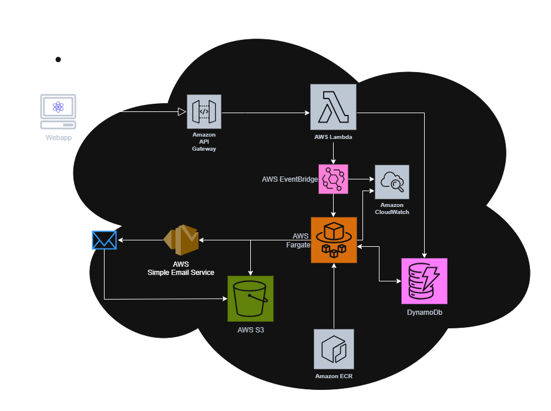

# Vidulum Tax-Tool

## Table of Contents
- [Overview](#overview)
- [Feature Highlights](#feature-highlights)
- [Architecture](#architecture)
- [To run locally](#to-run-locally)
- [To Run with docker:](#to-run-with-docker)
- [Deploying your Infrastructure](#deploying-your-infrastructure)
- [Destroying your Infrastructure](#destroying-your-infrastructure)

---

## Overview
The **Vidulum Tax-Tool** lets a user submit one or more wallet addresses (across supported chains), gathers historical transactions from configured explorers, compiles a CSV report, stores it in S3, and emails the requester a link and status update. The workflow is split into a lightweight API for request intake and an asynchronous worker for heavy processing so the API stays responsive.

**What it does**
- Accepts **multiple wallet addresses** across supported coins in one request.
- Queues the request and **tracks status** (pending/completed/failed) in DynamoDB.
- **Asynchronously** fetches transaction history, builds a CSV, uploads it to S3, and **emails** the user via SES.
- Scales processing using **ECS Fargate** (on-demand tasks).
- API runs in **AWS Lambda** (Serverless Framework), worker runs as a **container** (ECR → Fargate).

**Typical use**
- POST to `/collect-transaction-history` in AWS (or `/get-transaction-history` locally) with:
```
{
  "emailAddress": "user@example.com",
  "cutoffDate": "Fri, 1 Jan 2021 00:00:00 GMT",
  "addresses": [
    { "walletAddress": "0x...", "coinSymbol": "ETH" },
    { "walletAddress": "v1...", "coinSymbol": "VDL" }
  ]
}
```

---
## Feature Highlights

- **Pricing & Cost Control**
  - **Serverless API** on AWS Lambda (via `serverless-http`) — billed per request with no idle servers.
  - **“Fat-Lambda” worker on ECS Fargate** — tasks spin up only when triggered by EventBridge and terminate after processing, so you only pay for work done.
  - **Free/low-cost AWS services**: S3 (CSV storage), DynamoDB (on-demand), EventBridge (triggers), CloudWatch Logs (observability), SES (email; sandbox-friendly), ECR (image hosting). VPC Endpoints help avoid NAT egress where used.

- **What the App Delivers**
  - **Multi-wallet, multi-chain** transaction history collection in a single request.
  - **CSV export** streamed directly to S3 (AES-256 server-side encryption).
  - **Email notifications** with links to results via Amazon SES.
  - **Status tracking** (pending/completed/failed) in DynamoDB.

- **Supported Coins**
  - BTCZ, BZE, CMM, DASH, ILC, KMD, LTZ, TENT, GLINK, VDL-L (Legacy VDL), VRSC, FLUX, ZEN, ZER, **ETH**, **BNB**, **BTC**, DGB, DOGE, FIRO, GRS, LTC, RITO, RVN, SCRIV, SSS, VGC, ZEC, VDL  
  _Add/remove symbols in your coin config and API keys as needed._

- **Developer Experience**
  - **One-command deploy** (`npm run deploy`) builds/pushes the worker image, applies Terraform, and deploys the Lambda/API (Serverless Framework).
  - **Dockerized worker** to mirror Fargate locally; **local Express mode** for the API (`npm run start`).
  - **Polished local run experience** with a visible progress/“loading” feel and structured logs (request IDs, stages).
  - **Config-driven**: explorers and keys via `API_KEYS` and env vars; coin adapters are extensible (`src/configs/coinConfigs.js`).

- **Security & Ops**
  - **Least-privilege IAM** roles for Lambda, ECS task execution, and EventBridge targets.
  - **Encrypted storage**: S3 AES-256 SSE; no secrets committed—use environment variables or `secrets.json` (Serverless) for deployment.
  - **VPC + Security Groups** with **VPC Endpoints** for private service access where applicable.
  - **CloudWatch Logs** across Lambda and worker tasks for end-to-end traceability.

- **Scalability & Reliability**
  - **Event-driven pipeline** (API → EventBridge → Fargate) decouples intake from processing.
  - **Horizontal scaling** by launching multiple Fargate tasks when more jobs arrive; API remains responsive.  
  
----
## Architecture
**Components & flow**
1. **API Gateway → Lambda (Express)**  
   - Validates input, writes request + initial status to **DynamoDB** (`tax-app-requests`).
   - Emits a **custom EventBridge event** to kick off processing.

2. **EventBridge Rule (`Start-Tax-App`)**  
   - Targets **ECS Fargate** with the task definition for the worker container.  
   - Also logs to **CloudWatch Logs**.

3. **ECS Fargate Worker (ECR image)**  
   - Pulls queued request from **DynamoDB**.  
   - Fetches chain data using configured explorers/APIs.  
   - Streams CSV directly to **S3** (`tax-app-transactions`, AES-256 server-side encryption).  
   - Sends email via **SES** (from your verified `SOURCE_EMAIL`).  
   - Updates request status in **DynamoDB** to completed/failed.

4. **Networking & IAM**  
   - **VPC** with public subnet & SG; **VPC endpoints** for DynamoDB/EventBridge.  
   - **IAM roles/policies** for Lambda execution, ECS task execution, and EventBridge target.  
   - **CloudWatch** for Lambda/worker logs.

**At a glance**
```
[ Client ] ── POST ──► [ API Gateway ] ─► [ Lambda (Express) ]
                                     │      └─► DynamoDB (request + status)
                                     └─► EventBridge (job event)
                                     
EventBridge ──► ECS Fargate (worker task from ECR)
                  │  fetch tx data
                  ├─► S3 (CSV multipart upload)
                  ├─► SES (email user)
                  └─► DynamoDB (status update)
```



---

## To run locally

1. Create `.env` file with the following properties  
```
PORT=8080
API_KEYS={"keys":[["ETH","<EtherscanAPIKey>"],["BNB","<BscScanAPIKey>"]]}
NODE_ENV=development
SOURCE_EMAIL=<AWS SES verified Email address Required>
REGION=us-east-1
ACCESS_KEY=<AWS Access Key>
SECRET_KEY=<AWS Secret Key>
BUCKET_NAME=tax-app-transactions
REQUEST_TABLE_NAME=tax-app-requests
API=true
```

2. Run Npm install  
   * `npm i`

3. Run the app with node:  
   * `npm run start`

4. Hit the API with Postman requests to `http://localhost:8080/get-transaction-history/`

5. Request Body should look like:  
```
{
  "emailAddress": "you@example.com",
  "cutoffDate": "Fri, 1 Jan 2021 00:00:00 GMT",
  "addresses": [
    {
      "walletAddress": "0xF641063762a63CCb02143a554442ba4003096be1",
      "coinSymbol": "ETH"
    },
    {
      "walletAddress": "v1Q7SrcekFArG2jEihRAQGygeQyPxhWWsg1",
      "coinSymbol": "VDL"
    }
  ]
}
```

6. Open another terminal/shell in your project directory  
   * Ensure your secrets/env includes the line:
```
API=true
```

7. Run the app again from your second terminal to simulate the worker (“fat-lambda”) locally  
   * `npm run start`  
   * This will spin up an app that will pull the pending request and process it before terminating itself.

8. Check your email provided in your original API request.

9. **Alternative (local-only):** you can also POST your request to `http://localhost:8080/process-request` but this endpoint is disabled in AWS so it will only work locally.

---

## To Run with docker:

1. Install Docker
2. Run docker build  
   * `docker build -t vidulum-tax-app .`
3. Run docker container    
   * `docker run -p 8080:8080 vidulum-tax-app`  
4. Hit the API with Postman requests to `http://localhost:8080/get-transaction-history/`
5. Request Body should look like:  
```
{
  "emailAddress": "you@example.com",
  "cutoffDate": "Fri, 1 Jan 2021 00:00:00 GMT",
  "addresses": [
    {
      "walletAddress": "0xF641063762a63CCb02143a554442ba4003096be1",
      "coinSymbol": "ETH"
    },
    {
      "walletAddress": "v1Q7SrcekFArG2jEihRAQGygeQyPxhWWsg1",
      "coinSymbol": "VDL"
    }
  ]
}
```

---

## Deploying your Infrastructure

1. Install terraform (Chocolatey required)  
   * `choco install terraform`
2. Install AWS CLI
3. Add AWS credentials to AWS CLI
4. Install Docker Desktop
5. Run Docker Desktop as admin (and make an account if you don’t have one)
6. Install `jq`  
   * `chocolatey install jq`
7. Install Serverless  
   * `npm install serverless -g`
8. Run Terraform  
   * `terraform init`  
   * `terraform apply`  
     * It will ask if it can create a bunch of resources, type `yes`  
     * You may receive an error that says: “Error attaching policy” — ignore this  
   * Run `terraform apply` again. This will attach the above-mentioned policy.  
     * Type `yes` to the prompt
9. ~~Create `secrets.json` with this command:~~  
   * ~~`terraform output -json | jq 'with_entries(.value |= .value)' > secrets.json`~~  
   * *Note: this step is now included in the deploy script*
10. Make sure Docker Desktop is running as administrator (if on Windows)
11. ~~Push your docker container to ECR~~ *Note: now included in the deploy script*  
   * ~~`npm run docker-push`~~  
   * ~~May require adding execution permissions on `docker-pu.sh`~~
12. ~~Deploy your lambda~~ *Note: now included in the deploy script*  
   * ~~`serverless deploy`~~
13. Run the deploy script: `npm run deploy`  
   * May require adding execution permissions on `deploy.sh`  
   * After it completes you will see something like this (you may need to scroll up in the terminal to see the URL):  
```
✔ Service deployed to stack vidulum-tax-tool-dev (352s)
endpoints:
GET  - https://oqyjtun0xb.execute-api.us-east-1.amazonaws.com/dev/
POST - https://oqyjtun0xb.execute-api.us-east-1.amazonaws.com/dev/collect-transaction-history
ANY  - https://oqyjtun0xb.execute-api.us-east-1.amazonaws.com/dev/{proxy+}
functions:
app: vidulum-tax-tool-dev-app (15 MB)
```
   * Copy the **POST** URL

14. Send a POST request to the URL in Postman  
    Example request:  
```
{
  "emailAddress": "<Your Email address>",
  "cutoffDate": "Sat, 1 Jan 2022 00:00:00 GMT",
  "addresses": [
    { "walletAddress": "vdl1a053qfm6wsw6xmmpq9ncaxvtfnd9m4757jmx4y", "coinSymbol": "VDL" },
    { "walletAddress": "t1gdx2tuLtZAKMt4BV7Ax2RCNjqBMzcxDye", "coinSymbol": "BTCZ" },
    { "walletAddress": "bze1j26s9s9r576rcdkc8cl6dh5k4she6u572dth7c", "coinSymbol": "BZE" }
  ]
}
```

   * List of currently supported coins:  
     * BTCZ, BZE, CMM, DASH, ILC, KMD, LTZ, TENT, GLINK, VDL-L (Legacy VDL), VRSC, FLUX, ZEN, ZER, ETH, BNB, BTC, DGB, DOGE, FIRO, GRS, LTC, RITO, RVN, SCRIV, SSS, VGC, ZEC, VDL

15. Log into AWS to see ECS running.
16. Check your email in a few minutes.

---

## Destroying your Infrastructure
There may come a time when you want to destroy the AWS resources you’ve built either to save costs temporarily or sunset the project. These are the instructions to do so.

1. Run `serverless remove`  
   1. This will remove the Lambda and API Gateway  
   2. This command typically takes a long time to run (15–20 minutes). Don’t worry.
2. Run `terraform destroy`  
   1. This will destroy most resources, but you may need to log into AWS and manually delete the IAM role for EventBridge and any files created in the S3 bucket. (You can also try to run `terraform destroy` again to delete the role; not fully tested.)  
      * Fortunately these remaining resources should not cost anything if you choose to leave them (at least under the current AWS free tier).
